# Data_viz

วัชรินทร์ คำบาง 613020975-8

ตัวอย่างการเทรกรูป

#การบ้านครั้งที่1

ขั้นตอนการบันทึก file from Google collaborate to github.com

ขั้นตอนที่ 1 

สร้าง text โดยการ กดที่ cell ข้างบนของ code

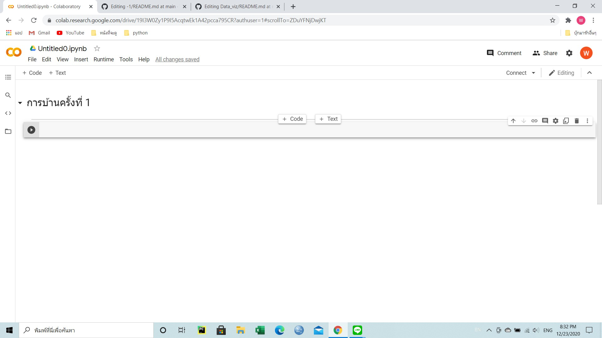

เขียน text ที่ต้องการลงไป

markdown เป็น Heading

เขียน code คือ print('วัชรินทร์')

ตัวอย่างรูปภาพ
         
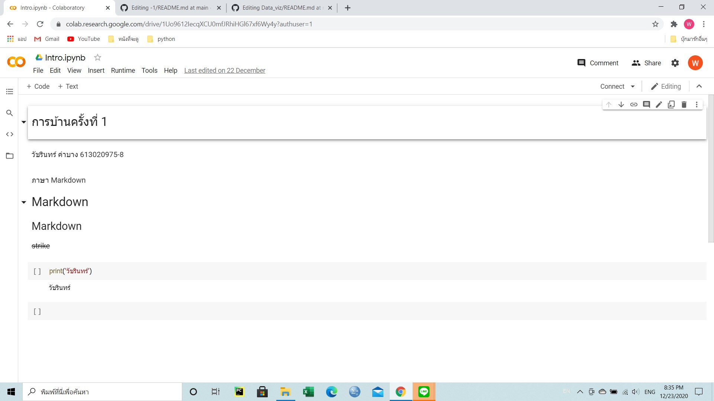
         
ขั้นตอนที่ 2

สร้าง Create a new repository

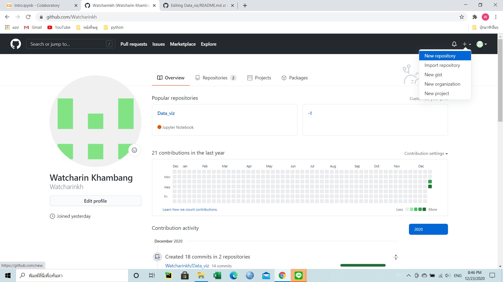

กำหนดชื่อที่จะสร้าง

กด public 

Initialize this repository with เลือก Add a README file

กด Create repository

ตัวอย่าง
         
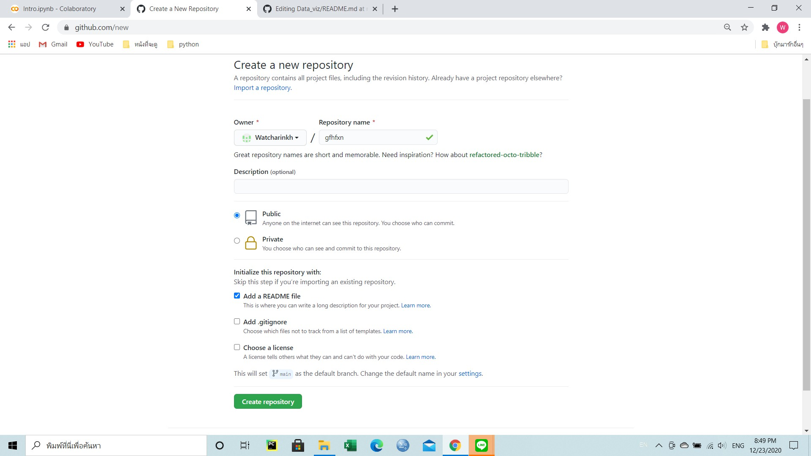         
         
         
เข้า repository ที่สร้างไว้จะขึ้นชื่อที่กำหนดไว้

พิมพ์ ชื่อ-นามสกุล รหัสนักศึกษา

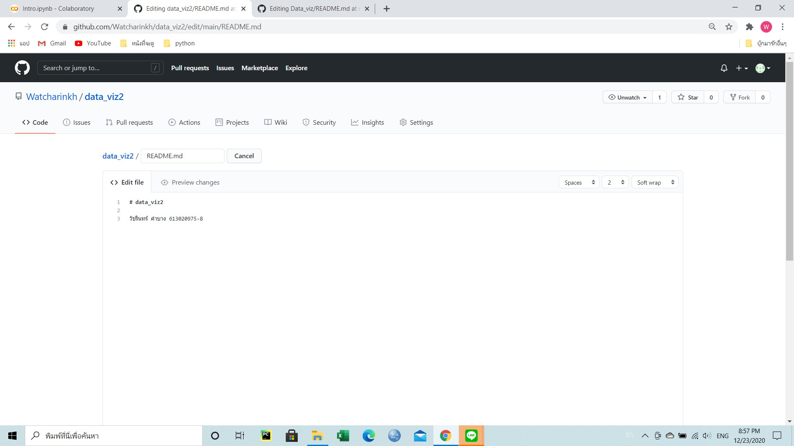

เเทรกรูปที่ต้องการ

กด Add file 

กด upload file

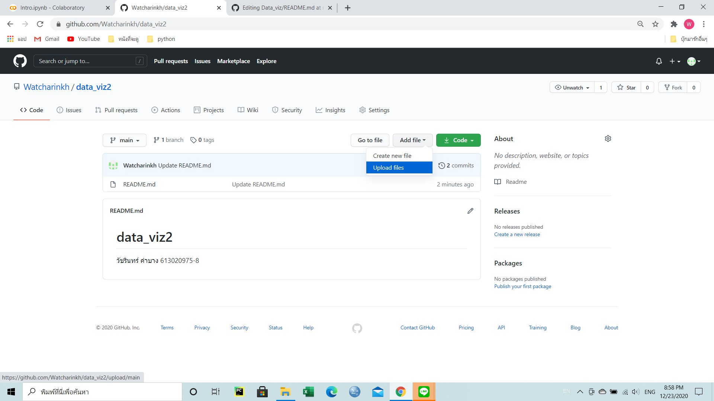

เลือกไฟล์รูปที่ต้องกดอัปโหลด 

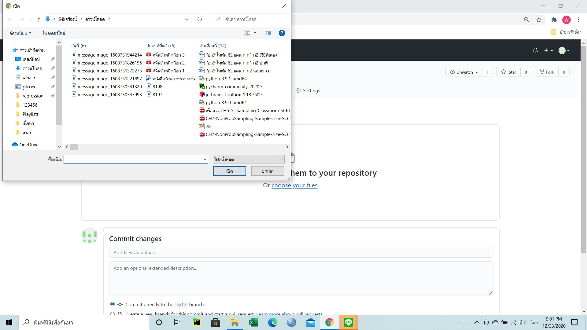

กด commit chage

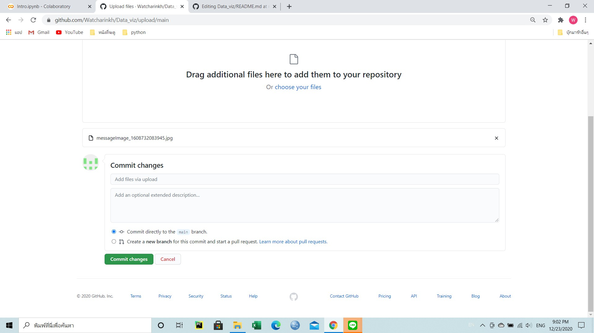

เมื่อ commit change รูปเรียบร้อยเเล้ว

กดเเก้ไข READ.md

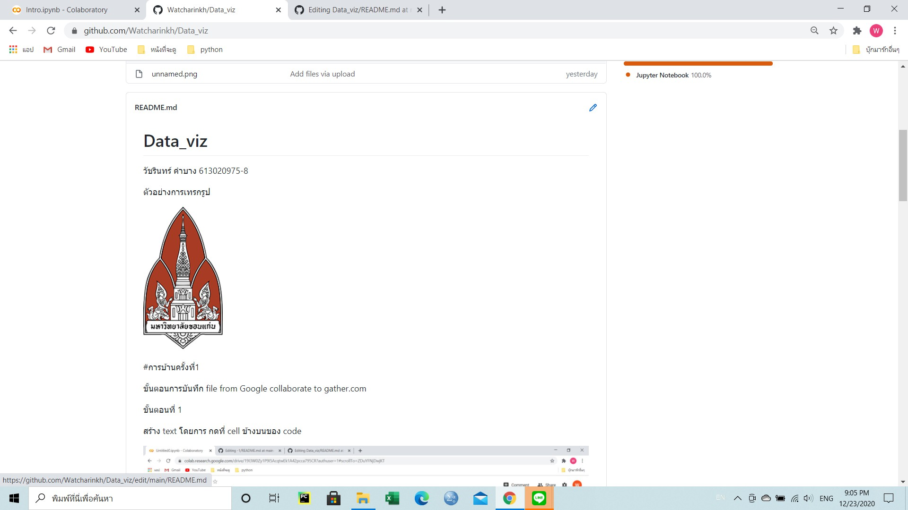

เขียนโค้ดเพื่อเเทรกรูป 

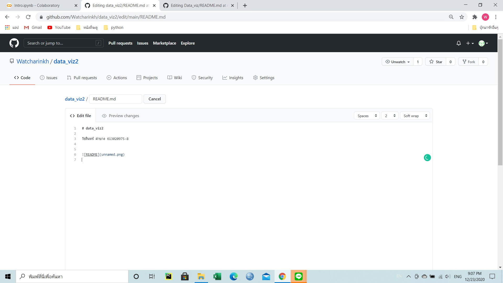
         
         
ขั้นตอนที่ 3

เข้า colab หน้าที่เราสร้างไว้ 

กด file 

เลือก Save a copy as a GitHub Gist

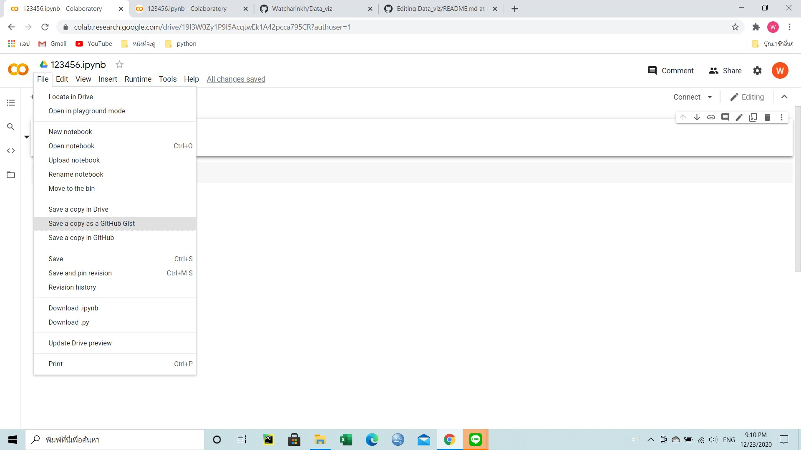

เมื่อ save เรียบร้อยเเล้วจะขึ้นหน้าต่อไปนี้
                 
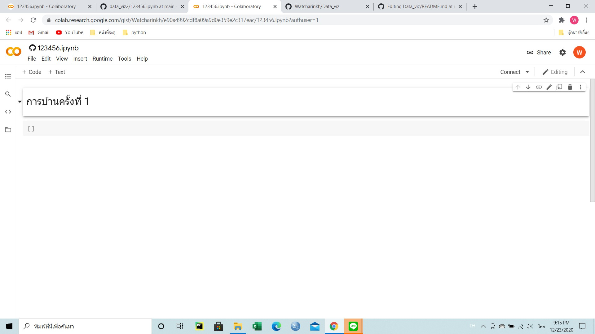

ต่อไป กด save in a copy GitHub

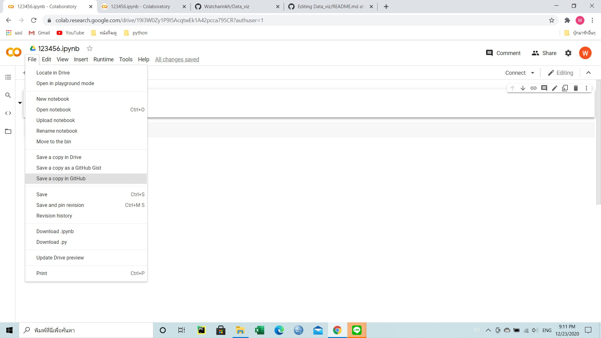

เมื่อกดsave in a copy GitHub จะขึ้นหน้าต่อไปนี้ เลือกrepositoryเเละกด ok

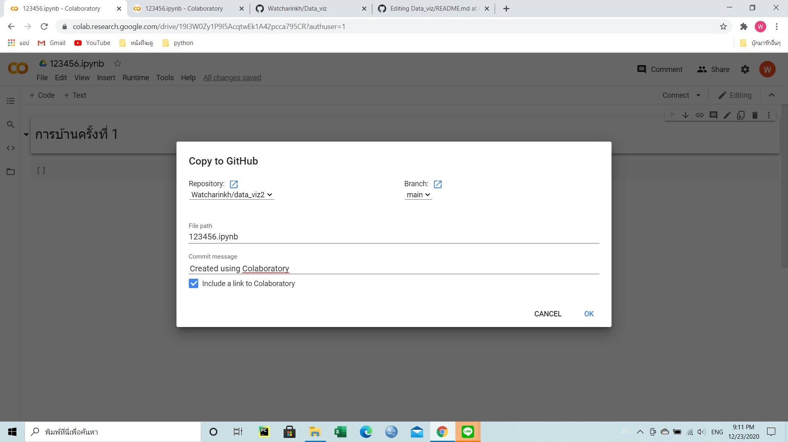

เมื่อกด ok เรียบร้อยเเล้ว โปรเเกรมจะรันกลับไปที่ GitHub

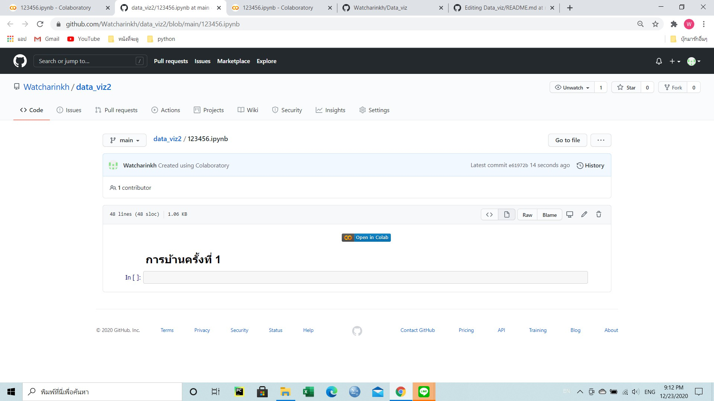

เสร็จสิ้นกระบวนการบันทึก file from Google collaborate to github.com

                 
                 
                 
                 
                 
                 
                 
         
